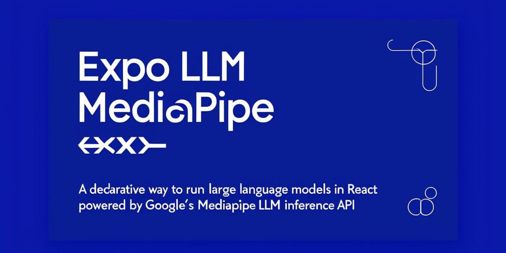

<div align="left">
  
  
  
  
</div>

# Expo LLM MediaPipe



Expo LLM MediaPipe is a declarative way to run large language models (LLMs) in React Native on-device, powered by Google’s MediaPipe LLM Inference API 🚀.

The MediaPipe LLM Inference API enables running large language models entirely on-device, allowing developers to perform tasks such as generating text, retrieving information in natural language form, and summarizing documents. Expo LLM MediaPipe bridges the gap between React Native and Google’s cutting-edge on-device AI capabilities, enabling developers to integrate state-of-the-art generative AI models into their mobile apps without requiring deep knowledge of native code or machine learning internals.

## Documentation

Take a look at how our library can help build you your Expo React Native AI features in our docs: \
[https://tirthajyoti-ghosh.github.io/expo-llm-mediapipe/](https://tirthajyoti-ghosh.github.io/expo-llm-mediapipe/)

## Quick Start - Running Gemma

### Step 1: Installation

```bash
npx expo install expo-llm-mediapipe
```

### Step 2: Setup and init

```tsx
import { useLLM } from 'expo-llm-mediapipe';

function App() {
  const llm = useLLM({
    modelName: 'gemma-1.1-2b-it-int4.bin',
    modelUrl: 'https://huggingface.co/t-ghosh/gemma-tflite/resolve/main/gemma-1.1-2b-it-int4.bin',
    maxTokens: 1024,
    temperature: 0.7,
    topK: 40,
    randomSeed: 42,
  });

  // ... rest of your app
}
```

### Step 3: Download & Load the model

```tsx
const download = async () => {
  const model = await llm.downloadModel();
  console.log('Model downloaded:', model);
};

const load = async () => {
  const model = await llm.loadModel();
  console.log('Model loaded:', model);
};
```

### Step 4: Run the model

```tsx
const run = async () => {
  const result = await llm.generateResponse('How do you plan to escape the interweb?');
  console.log('Model result:', result);
};
```

## Minimum Supported Versions

- **iOS**: 14+
- **Android**: SDK 24+

## Demo

<video height="500" src="https://video.twimg.com/amplify_video/1911844223751467008/vid/avc1/720x1178/azC3A2-aCaGPe9cC.mp4?tag=14" controls autoplay loop></video>

## License

This project is licensed under the [MIT License](./LICENSE).

## Code of Conduct

Please read our [Code of Conduct](./CODE_OF_CONDUCT.md) before contributing.
